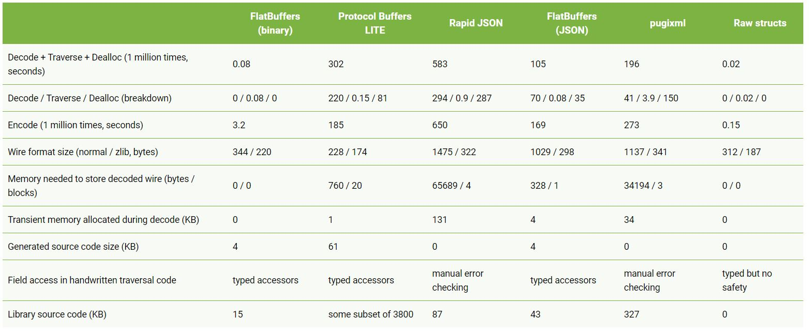

### Introduction

### Why Compilers
- Every software engineer are familiar with gcc/clang etc.
- So why do we need compiler for Deep Learning, when we can code in python ?
- Just as a compiler produces machine assembly code for programs, neural network compilers generate the Intermediate Representations of DNN operations.
- Some of these DNN operations are softmax, L1-Norm, conv2d/3d, tanh etc.
- Certain hardware like for ex- DMA can perform operations like transpose, color conversion etc faster than CPU/DSP/GPU.
- Hence, for which hardware to support what operation, comes under the domain of neural network compilers.

### Software Approach

#### Serialization

- 

##### 1. Flatbuffer

- Cross platform library.
- Advantages
   - Small code footprint
   - Very fast
   - used with mmap/streaming
   - Strong type check system.
   - Very imp is its memory foot-print during usage.

##### 2. Comparision table
