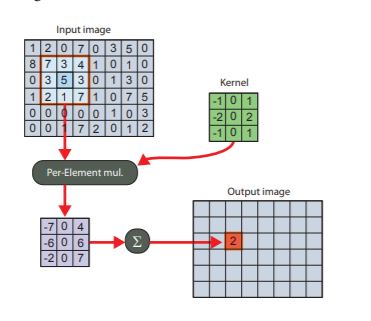

## Introduction
### Tiling
- Suppose we have a high resolutiom image like Full HD.
- In servers and desktops, we have large DRAM size where we can fit the entire image size.
- However for edge and mobile devices, DRAM are limited size.
- Also DRAM to Compute unit data transfer are costly in terms of latency.
- Also we cannot increase the size of SRAM as SRAM costs are high.
- Hence we "tile" the image , and the required tile is fit into the SRAM/TCM (Tightly Coupled Memory) for further processing.
  
###### Terms and definitions
- Tile : 
   - A tile is defined in terms of height and width.
   - A operations or kernel may have different input and output tiles.
-  Neighbour pixel :
   - Four direction of the processed pixel
-  Invalid pixel :
-  Actual tile :
   - All the pixsl in a tile except the dont care pixels
   -  

###### Challenges
- Tiling may sound simple, but for some operations it is not
- One ex- applying 3x3 filter kernel for blurring to image.
  
 

- As we can observe, tiling may cause the same kernel being applied twice in a group of pixels.
- This may cause information loss in cirical areas like edges, which we must avoid.

### Padding

 

## Advantages

 

## Examples

### Points to Developers

- 2D Tiling and Padding are relatively easy to manage.Tensor or higher dimension tiling are trickier.
- 