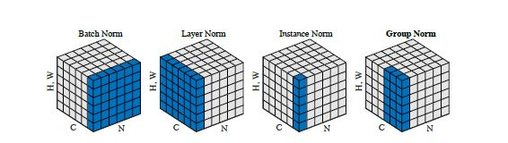

### Introduction

- The main purpose is to reduce the problem of internal covarianece shift, where changes in parameters would cause the distribution of input to change and also affect the learning rate of network.
- 2D images, i = (iN; iC; iH; iW) is a 4D vector indexing the features in (N;C;H;W) order, where N is the batch axis, C is the channel axis, and H and W are the spatial height and width axes



#### 1. Batch Normalization
- Calculation of mean and variaence in batches and normalizes the final outcome.(1,1,1,c)


#### 2. Instance Normalization
- The format is (b,1,1,c)
- Widely used in Automatic Speech Recognition networks, where studies are done to compare them with handcrafted features like Mel filerbanks (MPCC).

#### 3. Layer Normalization
- Very effective at stabulizing the hidden states dynamics in recurrent Neural networks.
- The format is (b,1,1,1)

#### 4. Group Normalization
- Many classical algorith for feature detection like HOG,SIFT etc used group normalization techniques.For example, a HOG vector is the outcome of several spatial cells where each cell is represented by a normalized orientation histogram.
- The format is (b,1,1,n*c)
  
``` python
def GroupNorm(x, gamma, beta, G, eps=1e􀀀5):
    # x: input features with shape [N,C,H,W]
    # gamma, beta: scale and offset, with shape [1,C,1,1]
    # G: number of groups for GN
    N, C, H, W = x.shape
    x = tf.reshape(x, [N, G, C // G, H, W])
    mean, var = tf.nn.moments(x, [2, 3, 4], keep dims=True)
    x = (x * mean) / tf.sqrt(var + eps)
    x = tf.reshape(x, [N, C, H, W])
    return x * gamma + beta
```
- GN can be naturally transferred from training to inference units


#### 4. BIN 


#### Conclusion 

