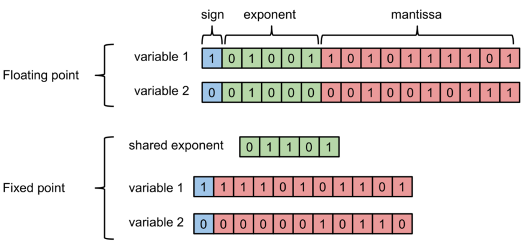
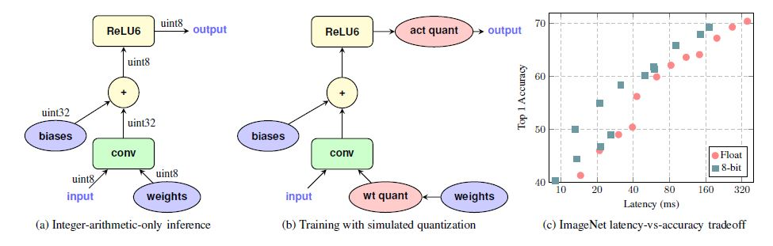
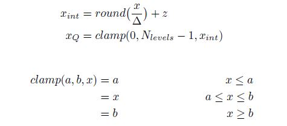
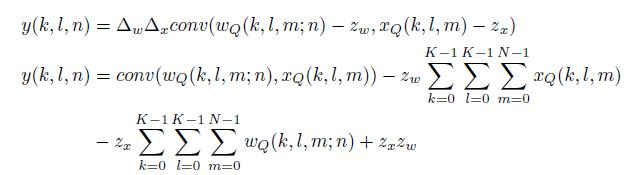
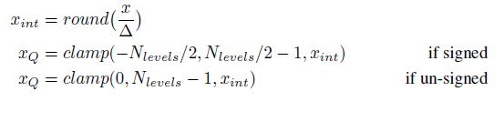
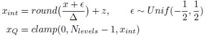

### Introduction

##### Float vs Fixed Inference 

- Use floating point when dynamic range is much more important criteria than accuracy.
- With the correct Q-factor or scaling factor and proper rounding, Fixed point integers provide acceptable accuracy, but much better power to performance ration.
 



### Types
#### 1. Affine/Assymetric Quantization
- The zero point is variable.
  


- Let us see an example for Multiply accumalate 1D convolution operation : 


#### 2. Symmetric quantization
- The zero point is fixed at 0.

#### 3. Stochastic quantization
- Adds a normal distribution noise to the float input before scaling and rounding.


- For dequantization operation, we just multiply the Quantized value with scaling factor.
### Quantization aware training

In QAT, as opposed to computing scale factors to activation tensors after the DNN is trained, the quantization error is considered when training the model. The training graph is modified to simulate the lower precision behavior in the forward pass of the training process. This introduces the quantization errors as part of the training loss, which the optimizer tries to minimize during the training. Thus, QAT helps in modeling the quantization errors during training and mitigates its effects on the accuracy of the model at deployment.

However, the process of modifying the training graph to simulate lower precision behavior is intricate. You must modify the training code to insert FakeQuantization nodes for the weights of the DNN Layers and Quantize-Dequantize (QDQ) nodes to the intermediate activation tensors to compute their dynamic ranges.

The placement of these QDQ nodes is also critical so as not to affect the learning capabilities of the model. For example, we can combine the Conv -> Bias -> ReLU and Conv -> Bias -> BatchNormalization -> ReLU compute blocks. In that case, adding a QDQ layer only makes sense to the output tensor of the ReLU activation. For more information, see Quantization-Aware Training.

Not all activation layer types are friendly to quantization. For example, networks with regression layers typically require that the output tensors of these layers not be bound by the range of the 8-bit quantization and they may require finer granularity in representation than 8-bit quantization can provide. These layers work best if they are excluded from quantization.

- Training 
    ```python
    # Build forward pass of model.
    ...
    loss = tf.losses.get_total_loss()
    # Call the training rewrite which rewrites the graph in-place
    # with FakeQuantization nodes and folds batchnorm for training.
    # One can either fine tune an existing floating point model
    # or train from scratch. quant_delay controls the onset
    # of quantized training.
    tf.contrib.quantize.create_training_graph(quant_delay=2000000)
    # Call backward pass optimizer as usual.
    optimizer = tf.train.GradientDescentOptimizer(
    ```

- Evaluation
    ```python
    # Build eval model
    logits, end_points = network_model(inputs,...)
    # Call the eval rewrite which rewrites the graph in-place
    # with FakeQuantization nodes and fold batchnorm for eval.
    tf.contrib.quantize.create_eval_graph()
    ```


### Pytorch vs Tensorflow Lite Quantization

#### Pytorch
- Uses two projects in backend
    - FBGEMM
    - ARM QNNPACK
-  Has limited data manipulation support
-  Observers - use input statistics to compute quantization parameters.


#### Tensorflow Lite (v2.2)
- Supports 
    - Post training float16 quantization
    - Post training dynamic quantization
    - Post training integer quantization
    - Quantization aware training