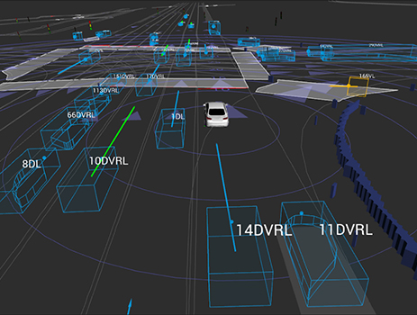

## Introduction
- L5Kit is a library which lets you:
    - Load driving scenes from zarr files
    - Read semantic maps
    - Read aerial maps
    - Create birds-eye-view (BEV) images which represent a scene around an ego or surrounding vehcile.
    - Sample data
    - Train neural networks
    - Visualize results

## Datasets
Instead of working with raw data, L5Kit provides PyTorch ready datasets. It's much easier to use this wrapped dataset class to access data.

2 dataset class is implemented.

EgoDataset: this dataset iterates over the AV (Autonomous Vehicle) annotations
AgentDataset: this dataset iterates over other agents annotations