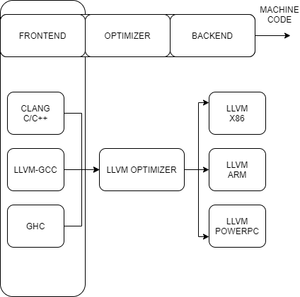

### Architecture

### Frontend
- libclangLex 
  - This library is used for pre-processing and lexical analysis, handling macro and pragma constructions

- libclangAST
  - all abstract syntax tree related functionalitites.

- libclangparse
  - used for parsing logic using the results from the lexical phase

- libclangSema
   - This library is used for semantic analysis, used for AST verification.

- libclanfCodegen
   - LLVM IR code generator using target specific information

- libclangAnalysis
   - This library contains the resources for static analysis

- libclangRewrite
   - This library allows support for code rewriting and proving to build code refactoring tools

- libclangBasic
   - This library provides a set of utilities - memory allocation abstractions, source locations, and diagnostics.

##### LLVM IR 

- a low -level programming language similar to assembly
- strongly typed RISC instruction set which abstracts away most details of the target.
- No fixed set of registers.
- Has three forms :
  - a human-readable format
  - an in-memory format for frontends
  - a dense bit code for serializing

###### Register vs Stack based compiling 
- Stack makes interpreting, naive compilation easier
- Register makes various optimisations easier

###### Hierchical IR

- Easy to express high-level constructs
- Preserves program semantics
- Preserves high-level semantics (variable lifetime, exceptions) clearly
- Example: WHRIL in MIPSPro/Open64/Path64 and derivatives
  
###### Flat IR

- Easy to map to the back end
- Simple for optimisations to process
- Must carry scope information in ad-hoc ways (e.g. LLVM IR has intrinsics to explicitly manage lifetimes for stack allocations)
- Examples: LLVM IR, CGIR, PTX

###### Static Single Assignment
- Registers may be assigned to only once
- Most (imperative) languages allow variables to be... variable
- This requires some e↵ort to support in LLVM IR: SSA registers are not variables
- SSA form makes dataflow explicit: All consumers of the result of an instruction read the output register(s)
###### Phi nodes
-  nodes are special instructions used in SSA construction
- Their value is determined by the preceding basic block
-  nodes must come before any non- instructions in a basic block
- In code generation,  nodes become a requirement for one basic block to leave a value in a specific register.
- Alternate representation: named parameters to basic blocks (used in Swift IR)
###### Get Element pointer
- Often shortened to GEP (in code as well as documentation)
- Represents pointer arithmetic
- Translated to complex addressing modes for the CPU
- Also useful for alias analysis: result of a GEP is the same object as the original pointer (or undefined)
- In modern LLVM IR, on the way to typeless pointers, GEP instructions carry the pointee typ
##### IMP Classes
- Module - A compilation unit.
- Function - 
- BasicBlock - a basic block
- GlobalVariable (I hope it’s obvious)
- IRBuilder - a helper for creating IR
- Type - superclass for all LLVM concrete types
- ConstantExpr - superclass for all constant expressions
- PassManagerBuilder - Constructs optimisation pass sequences to run
- ExecutionEngine - Interface to the JIT compiler
###### Cache coherency: MESI protocol
- Modified cache line contains local changes
- Shared cache line contains shared (read-only) copies of data
- Exclusive cache line contains the only copy of data
- Invalid cache line contains invalid data
######
