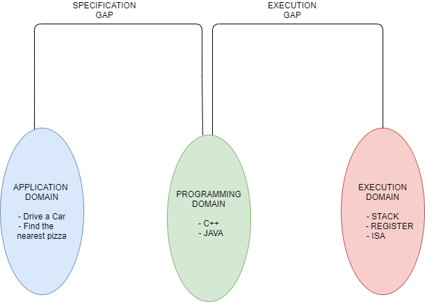
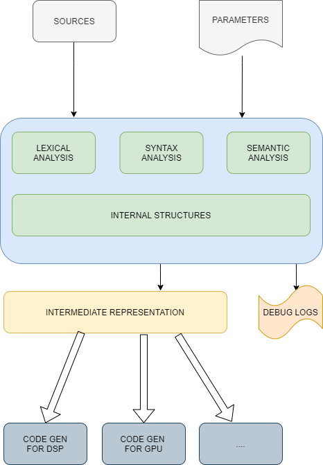
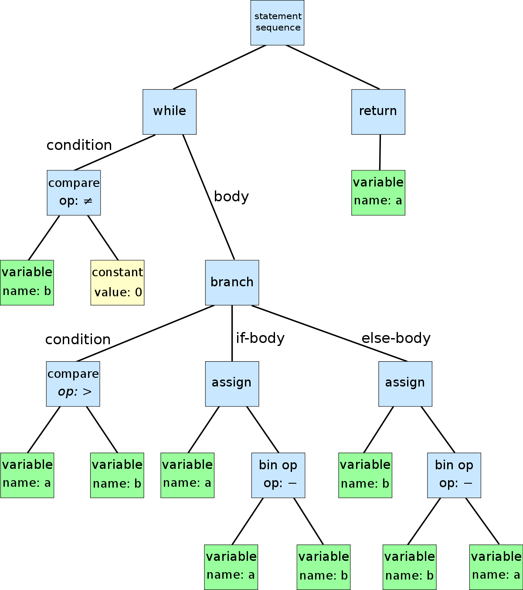

#### Introduction
###### Semantic Gaps

###### Goal and Task
- Goal: To overcome the semantic gap between the human way of thinking and computer solving task defined by human
- Task: To transform human written and human-friendly task to a form which can be executed by a computer.
  
###### General flow

- the blue squares denote some actions typical to any computer.
  
###### Data Structures
- There may be several source units. They can be represented not only as dsik files, nut have arbitary nature
- Lexical analysis may be implemented as a separate "pass" or as a component involving "by demand"
- Lexical analysis can work either sperarately or simultaneously
- On each compilation phase ( from lexical analysis to code generation) external sources can be added to the program: either in textual form or as pre-compiled components
- Some language assumes the linking stage which is often considered as a standalone phase
- Code generation phase often includes some optimizing sub-phases

### Lexical Analysis
###### The idea
- To convert the source stream of bytes to a sequence of tokens: the symbols from the language alphabet.
###### Syntax Analysis
- To check the correctness of the syntactic structure of the source program by the language grammar
- To convert the source program to an intermediate regular form which is suitable for subsequent processing ( semantic analysis, optimization, code generation)
-  Syntax analysis can be done together with semantic analysis 
-  The result of syntax analysis: an internal program representation. Ex - a tree structure whose nodes and subtrees correspond to structural elements of the source program

### Multi platform architecture

### Backend

###### Goal and Task
- Optimally map iven program to hardware without compromising correctness
- Select suitable processor instructions
- Allocate hardware registers
- Schedule instruction sequence

###### Subparts
- Data flow analysis: gather information about the possible set of values calculated at various points in a computer program
- Control Flow Analysis: static code analysis techniques for determining the control flow of the program
- Intermediate representation: the data structure code used internally by a computer to represent the source code.

###### Defs and Uses
- Definition of the variable is a point in the program where it is assigned to
- Use of variable isa point in code where its value is used
- Du-chain for a variable connects a definition of that variable to all the uses it may flow to
- Ud-chain connects a user to all the definitions that may flow to it.
  
###### Intermediate Representations
- System of structures that collects essential information about program convnenientfor analyusis, transformation and target code generation
- Two kinds
  - High level IR (platform independent)
  - Low level IR ( platform dependent)
- Ex - 
   - AAbstract Syntax tree
   - Static Single Assignemnt
   - gcc : GIMPLE, RTL
   - Clang : LLVM
   - V8 Java Script engine : Hydrogen, Lithium
  
###### Liveness Analysis
- Live variable analysis is a data flow analysis to calculate the variables that are life at each point in the program
- A variable is live at some point it holda a value that may be read before the next time the variable is deinges
- Used in register allocation to calculate live ranges of variables.
- Definitions :
  - Livein - live variables reaching block entry
  - liveout - live variables reaching block exit
  - use - variables used in the block before the definition
  - def - variables defined in block
  
###### Abstract Syntax Tree
 

###### Control Flow chart
(diagram)
###### Control Flow Graph
- Summarizes control flow with basic vlock and control edges
(diagram)
###### Data Flow Analysis
- Variations :
  - Forward analysis : from entry to exit
  - Backward analysis : from exit tot entry
  - Confluence operator : union vs intersection
- Problems :
   - Reaching dewfinitions - fiand an earlier instruction whose dinition can reach given without interevening assignemnt
   - Upward exposed uses - for each definition find all uses that it can reach
   - Live variables - calculate the variavbles that are live at rach point in the programa
   - Avaliable expressions
   - Copy propagation
  
###### Optimization
- Conditional Constant propagation 
- Tail recursion optimization
- Partial Redundancy elimination
- Register Allocation

### Parellelism
###### Types
- Bit level Parallelism
- Instruction level
   - Pipelining
   - Superscalar and VLIW
- Data level
   - SIMD
   - GPU
- Task level
  - Many core and multi core
  - Simultaneous multithreading, hyperthreading
  - clusters and data centers

###### Compiling for Instruction pipeline
- Structural hazards - resources do not support all possible cominations of instruction overlap
- Data hazards - result produced by one instruction is needed by a subsequent instruction
- Control hazards - pipeline stall due to branching instruction

######
######