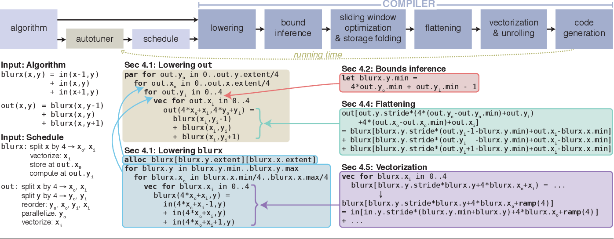

## Introduction

###### Why Halide
- Developing an optimized image processing kernel is difficult
- We can optimize say a Sobel filter 11 times faster than a CPU implementation
- However, handcrafting such optimization can tie to that one particular platform only
- Difficult to maintain a large number of such kernels
- Halide is the solution

###### What is Halide
- Halide [Ragan-Kelley et al. 2013] is a domain-specific language (DSL) and compiler for
image processing. It radically reduces the effort spent on development and optimization by
using an abstract, functional programming style, while decoupling the description of the
an algorithm from that of the execution strategy 
- Based on C++ operator overloading and equipped with a JIT compiler
- Supported architecture : 
   - x86, ARM, MIPS, Hexagon, PowerPC
- Supported OS :
   - Linux, Windows, macOS, Android, ioS, Qualcomm QuRT
- Supported GPU Compute APIs :
   - OpenCL, OpenGL, CUDA, Apple Metal, MS Direct X12
  
###### Halide architecture
- Halide supports the separation of algorithms and a schedule :
   - The algorithm represents the computation kernel, which the main loop.
   - Schedule represents the main computation and its organization, parallelism, and locality of data.
- Example: Gaussian Filtering
   - CPU kernel has 300 lines of code
   - Adobe: 1500 lines, lots of engineering hours, 10x faster. Has multicore, vectorization support
   - Halide: 60 lines, less engineering hours (2-3 days), 15x faster


```C++
func blur_3x3(func in) {
    Func blurx, blurt;
    Var x,y,xi,yi;

    // the algorithm
    blur(x,y) - (in(x-1, y) + in(x,y) + in(x+1, y)) / 3;
    blur(x,y) - (in(x, y - 1) + in(x,y) + in(x, y + 1)) / 3;

    // the schedule
    blury.tile(x,y,xi,yi, 256, 32).vectorize)xi,8).parallely);
    blurx.compute_at(nlury,x).vectoruze(x,8);
    return blury;
}
```

## Halide Algorithm

- Algorithm specifies the computation
- it is platform-independent
- Below are some Halide classes  for expressing algorithms :
   - Func: pure functions define over integer domain.
   - Expr: Algebraic expression of Halide Funcs.
   - Var: Abstract variable representing the domain.
   - Buffer, Image: represents the input, output and in/out buffers
   - RDom: explicit specification for reduction domains.
- Funcs are the main objects in Halide :
   - Hold computation kernels ( fx - core loop body )
   - Can be assigned to any execution target ( CPU, GPU, DSP)
   - JIT-compiled and executed or AOT compiled to file.


## Halide Schedule

- This specifies how computations are performed
- It is platform dependent
- Ex of schedule : 
  - Split a Halide vairable (loop strip mining) : func.split(x,x_outer, x_inner, 2)
  - Unrolling a Halide variable: func.unroll(x,4)
  - Parallelizing a Halide variable: function.parallel(y)
  - Tiling = splliting + re-ordering : funct.tlie(x, y, xi, yi, NX, NY)
  - Fuse a Halide variable(loop collapsing) : func.fuse(x,y)

###### Multistate Schedule
- Producer / Consumer relation between kernels
- Default : all calls to preocuder is in=-lines into consumer
- func.compute_root() : direct Halide to compute and cache procuducer
- func.compute_at() : direct Halide to compute producer and just enough for consumer
- func.store_root()
- func.store_root().compute_at()
  

## Compiler Internals
 


## Examples

[1. Basic-Syntax](./resources/basic.cpp)  
[2. Debugging](./resources/basic.cpp)  
[3. Optimizations](./resources/basic.cpp)  
[4. Pipelining](./resources/basic.cpp)  
[5. Compilation](./resources/basic.cpp)  
[6. Halide System](./resources/basic.cpp)  


### Reference

[1] Extending halide to improve software development for imaging DSPs, Vocke, S.  
[2] [Halide Lang](https://halide-lang.org/index.html#gettingstarted)  
 