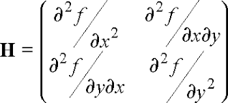

## Common Assumptions
- The basic idea of the Optical Flow algorithm rests on three assumptions.
  1. Brightness constancy. A pixel from the image of an object in the scene does not
change in appearance as it (possibly) moves from frame to frame. For grayscale images
(LK can also be done in color), this means we assume that the brightness of a
pixel does not change as it is tracked from frame to frame.

  2. Temporal persistence or “small movements”. Th e image motion of a surface patch
changes slowly in time. In practice, this means the temporal increments are fast
enough relative to the scale of motion in the image that the object does not move
much from frame to frame.

  3. Spatial coherence. Neighboring points in a scene belong to the same surface, have
similar motion, and project to nearby points on the image plane.

- There may be additional constraints imposed on algorithm, like variatiiobal refinement etc.

## Derivatives


#### Scharr Derivatives


#### Sobel Derivatives


## Hyperparameters

## Pyramid Generation


## Hessian Matrix
- Below is the Hessian matrix of a 2D signal of 2D image


- Generally the single derivative of a image is calculated by using the Sobel . These derivatives are multiplied togather.
  ```python
     
  ```

## Linear Algebra (Eigenvalue, Matrix decomposition)

## Border cases (padding, tiling etc)

- For determining optical flow outside the integration window, we have to design the algorithm such that it takes valid pixels at the appropriate 
iteration.Otherwise accuracy may be lost.

## Float vs Fixed 
- Accuracy and Speed tradoff plays an important role in chossing fixed point integers over floating point.
- The final optical flow vector are generally floating point.

#### References 

- [1981-IJCAI, Lucas-Kanade method] An iterative image registration technique with an application to stereo vision [`paper`](http://citeseer.ist.psu.edu/viewdoc/download;jsessionid=C41563DCDDC44CB0E13D6D64D89FF3FD?doi=10.1.1.421.4619&rep=rep1&type=pdf)
- [1981-AI, Horn-Schunck method] Determining optical flow [`paper`](http://citeseerx.ist.psu.edu/viewdoc/download?doi=10.1.1.66.562&rep=rep1&type=pdf)
- [2003-SCIA, Farneback flow] Two-frame Motion Estimation Based on Polynomial Expansion [`paper`](http://citeseerx.ist.psu.edu/viewdoc/download?doi=10.1.1.102.2455&rep=rep1&type=pdf) [`code`](https://docs.opencv.org/master/d9/d30/classcv_1_1cuda_1_1FarnebackOpticalFlow.html)
- [2004-ECCV, Brox method] High Accuracy Optical Flow Estimation Based on a Theory for Warping [`paper`](http://www.mia.uni-saarland.de/Publications/brox-eccv04-of.pdf) [`code`](https://docs.opencv.org/master/d7/d18/classcv_1_1cuda_1_1BroxOpticalFlow.html)
- [2005-IJCV] Lucas/Kanade meets Horn/Schunck: Combining local and global optic flow methods [`paper`](http://www.mia.uni-saarland.de/Publications/bruhn-ijcv05c.pdf)
- [2007-DAGM, TVL1 method] A duality based approach for realtime tv-l1 optical flow [`paper`](http://www-pequan.lip6.fr/~bereziat/cours/master/vision/papers/zach07.pdf) [`code`](https://docs.opencv.org/master/d6/d39/classcv_1_1cuda_1_1OpticalFlowDual__TVL1.html)
- [2011-TPAMI, LDOF flow] Large displacement optical flow: descriptor matching in variational motion estimation [`paper`](https://lmb.informatik.uni-freiburg.de/people/brox/pub/brox_tpami10_ldof.pdf) [`code`](https://lmb.informatik.uni-freiburg.de/resources/binaries/)
- [2013-ICCV, deep flow] DeepFlow: Large Displacement Optical Flow with Deep Matching [`paper`](https://www.robots.ox.ac.uk/~vgg/rg/papers/DeepFlow_iccv2013.pdf) [`homepage`](https://thoth.inrialpes.fr/src/deepflow/) [`code`](https://thoth.inrialpes.fr/src/deepflow/)
- Learning OpenCV, ORelly Publications