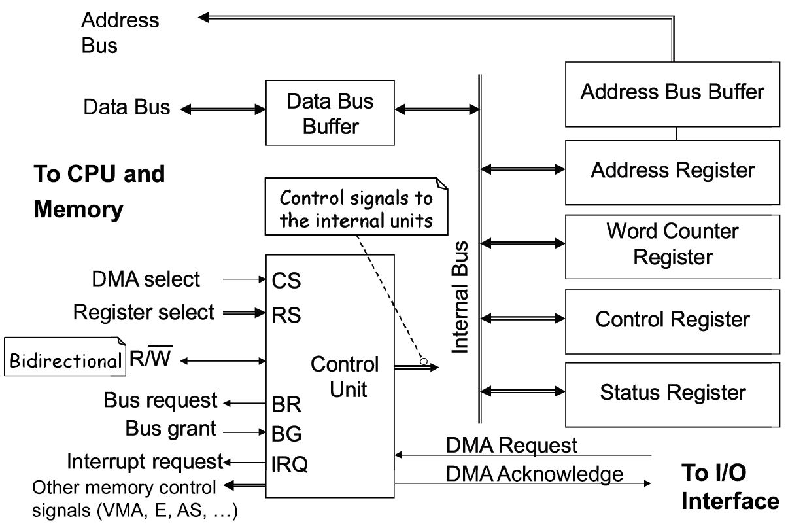

### Introduction
- DMA terchnique is used to rransfer large volumes of data between IO interfaces and the memory
- Also used for 
   - intra chips data transfer in multi core processors
   - memory to memory copying or moving of data
- A hardware controller  konw as DMA Controller is uded that can act a processig unit by genereating addressed and initiating memort read and write cycles.
- The CPU configures the DMAC and delegates the IO operations to it.
###### Overview
- Whenever request for data transfer, the IO interfce signals the DMAc
- DMAC requst the system bus from the CPU
- The CPU complestes the current bus scycle and isolates itself from the sysyten bus and  responsed to the DMA by activating BG
- Now thre DMAC is responsible for generaitng all bus signals and performing the transfer
- The CPPU can perform its internal operations
- The dat a dont pass through the CPU but the system bus is ocupied.

###### DMA Terms
- Event - a hardware signal that initiates a transfer on a DMA channel
- Channel - one thread of transfer. It contains source and destination addresses plus control information
- Element: 8-, 16-, 32-bit datum
- Frame: Group of elements
- Array: Group of contiguous elements
- Block: Group of Frames or Arrays
###### DMA vs Cache
- cache has problems in some DSP applications:
   - Data isn’t always reused, or has limited reuse
   - Cache only loads data when requested the first time
   - Cache line size may not be a good match for data size

### DMA transfer modes
DMA performs data transfer operation. The different DMA transfer modes are as follows:-

1) Burst or block transfer DMA

2) Cycle steal or single byte transfer DMA.

3) Transparent or hidden DMA.

1) Burst or block transfer DMA

It is the fastest DMA mode. In this two or more data bytes are transferred continuously.
Processor is disconnected from system bus during DMA transfer. N number of machine cycles are adopted into the machine cycles of the processor where N is the number of bytes to be transferred.
DMA sends HOLD signal to processor to request for system bus and waits for HLDA signal.
After receiving HLDA signal, DMA gains control of system bus and transfers one byte. After transferring one byte, it increments memory address, decrements counter and transfers next byte.
In this way, it transfer all data bytes between memory and I/O devices. After transferring all data bytes, the DMA controller disables HOLD signal & enters into slave mode.
2) Cycle steal or single byte transfer DMA.

In this mode only one byte is transferred at a time. This is slower than burst DMA.
DMA sends HOLD signal to processor and waits for HLDA signal on receiving HLDA signal, it gains control of system bus and executes only one DMA cycle.
After transfer one byte, it disables HOLD signal and enters into slave mode.
Processor gains control of system bus and executes next machine cycle. If count is not zero and data is available then the DMA controller sends HOLD signal to the processor and transfer next byte of data block.
3) Transparent or Hidden DMA transfer

Processor executes some states during which is floats the address and data buses. During this process, processor is isolated from the system bus.
DMA transfers data between memory and I/O devices during these states. This operation is transparent to the processor.
This is slowest DMA transfer. In this mode, the instruction execution speed of processor is not reduced. But, the transparent DMA requires logic to detect the states when the processor is floating the buses.
######
######
######
######
######
######
######
######
######
######
######
######