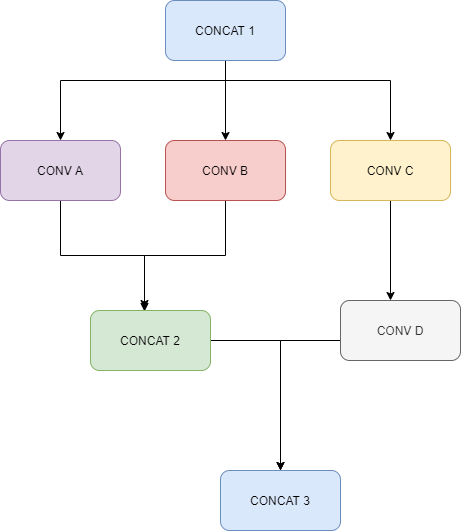

### Introduction

- The trick is not to put the cache near the processor. It’s counterintuitive, but it works. Most high-end embedded processors, like an Arm Cortex A-series, will have L1 and L2 caches for each CPU core. Sometimes, the processor complex has an L3 cache as well that’s shared among all the CPU cores. That all works fine. No adjustment is necessary. 

- Now, add a fourth cache – a last-level cache – on the global system bus, near the peripherals, and the DRAM controller, instead of as part of the CPU complex. The last-level cache acts as a buffer between the high-speed Arm core(s) and the large but relatively slow main memory. 

- This configuration works because the DRAM controller never “sees” the new cache. It just handles memory read/write requests as normal. The same goes for the Arm processors. They operate normally. No extra cache coherence hardware or software is required. Like all good caches, this last-level cache is transparent to software. 

  The above diagram shows a DNN layer whic can be improved via LLC utlization.

###### Motivation
- As deep learning and input feature maps grow bigger and heavier, the memory footprint required becomes large. During the runtime, several models run concurrently making memory issue severe.
- Aside from memory availability bottleneck, several transactions from slow DRMA type memory impacts performance
- Power consumption is also an issue for embedded systems.
- Memory compaction helps in :
   - reduce overall allocation required for intermediate feature maps
   - helps in allocating feature maps in limited regions of system cache instead of DRAM
   - Increased system cache transactions instead of DRAM reduces overall power consumption

###### Parameters
- Neural network model: a directed acyclic graph
   - Vertices - V
   - Edge - E
- Cluster: a group of feature maps that share common characteristics amongst each other. For DRAM compaction, a relation has been the same dram addresses the blob share
- Execution schedule: execution order of neural network on the heterogeneous platform
- Blob life: First and last access point of a feature map
- Cluster life : 
- Cluster priority
- Cluster final position
  
###### Ideas
- A method of creating a blob cluster that is related to each other that is governed by the topology of the neural network, execution schedule, and optimization method. This can be relocated as a whole without changing the relative position. For ex= the input feature maps of concat layers, features which can be added together to scratchpad memory with fused DMA operation, feature maps group together to om[rove compression efficiency, etc.
-  A method of estimating the priorities for feature map blob lusters, depending on the access frequency, blob cluster, liveness, etc to ensure minimum data traffic.]

### The Pros and Cons of a Last-Level Cache

- Like all good caches, a last-level cache helps improve performance dramatically without resorting to exotic or expensive (or ill-defined) memory technologies. It makes the generic DRAMs you have worked on better. Specifically, it improves both latency and bandwidth, because the cache is on-chip and far faster than off-chip DRAM, and because it has a wider, faster connection to the CPU cluster. It’s a win-win-win. 

- A cache takes up die area, of course. The cache-control logic (managing tags, lookup tables, etc.) is negligible, but the cache RAM itself uses a measurable amount of space. On the other hand, a last-level cache saves on power consumption, because nothing consumes more energy than reading or writing to/from external DRAM, especially when you’re hammering DRAM the way modern workloads do. Every transaction that stays on-chip saves a ton of power as well as time. 

- There’s also a security benefit. On-chip cache transactions can’t be snooped or subjected to side-channel attacks from signal probing or RF manipulation. Caches are tested with well-understood technology. That doesn’t mean they’re simple or trivial to implement – there’s a real art to designing a good cache – but at least you know you’re not beta-testing some vendor’s proprietary bleeding-edge memory interface.
  
### Working
- consider three-space : 
    - system MMU space
    - the mapping space
    - virtual address space
- Intermediate feature map area is separated into two-part
   - with the Last Level cache enabled
   - with Last Level Cache disabled
  