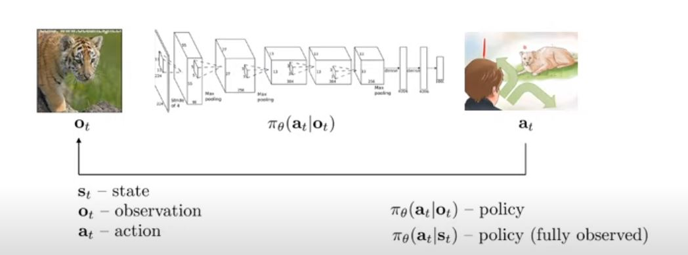

### Terminology

- fully: access to state
- partially: access to observations.

###### Reward Function
- tells us which date and actions are better.
  
###### Markov Decision process

- Markov chain: a set of states S and transition function T
- State can be discrete or continuous
- Transition (can be probability)
- Why the operator? so that for time step t+1 we can apply the transition operator.
- Markov Decision process : depends om 
   - State space
   - Action space
   - Transition operator
   - Reward function
- Hence it is a tensor
- Partially observed markov decision process
   - State space
   - Action space
   - Transition operator
   - Reward function
   - Observation Space
   - Emission probability
  
###### Expectation and stationary distribution

### Algorithms 

###### Value functions
###### Q function
- for other time steps
- sum over all time steps of the expected value of reward from that time step to.
###### Types of algorithms

- Policy gradient
- Value based
- Actor critic
- Model based RL
###### Tradeoffs
- Sample efficiency ( how many samples for good efficieny ?)
   - Off policy
   - On policy ( generate new samples each time policy changes)
- stability and ease of use
- Assumptions
   - Stochastic or deterministic
   - continuos or more discrete
   - Episodic or infinite horizon
- RL is not often gradient descent :
   - Q learning: fixed point iteration
   - Model-based RL: model is not optimized for expected reward
   - Policy gradient: least efficient even though gradient descent.