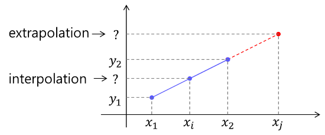
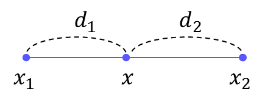
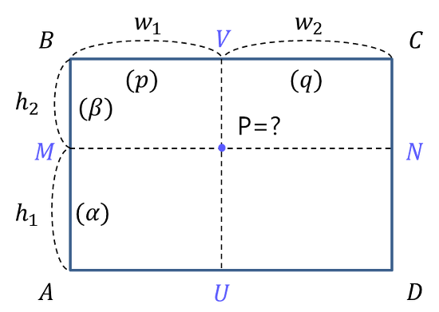
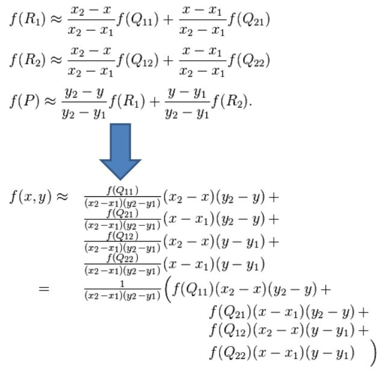
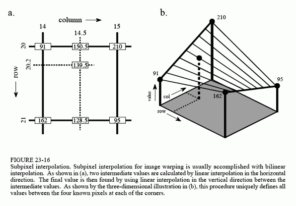
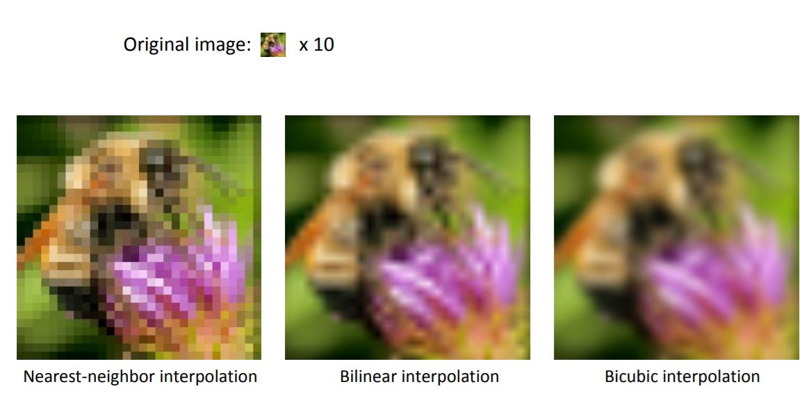
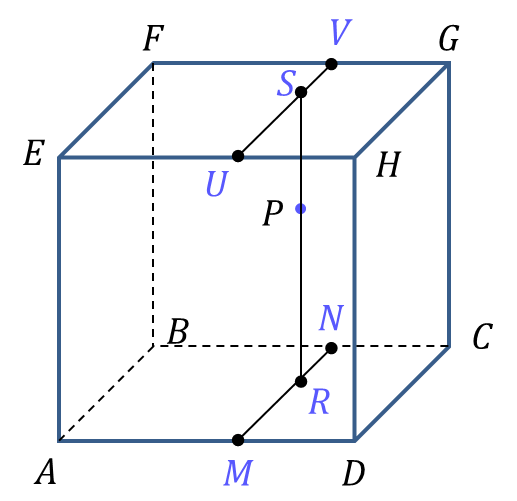
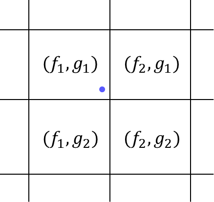

# Introduction
  - We use interpolation when we want to estimate a certain value located between the known values.
  - We use extrapolation when we want to estimate a certain value located outside the known values.  

# Types
## 1. Linear Interpolation

## 2. Bilinear interpolation
- This method calculates the output pixel by nearest weighted 4 pixels weghted sum in terms of distance.
- Resizing 2D feature map or image with bilinear interpolation. Every channel os independently calculated.
- If output size aligns well to input size, we can replace this by transposed convouilution.
  

#### 2.1 For non-rectangular connection
- We use warping
  
#### 2.1 For resizing Image or Feature map
- It calculates same ways as bilinear interpolation by deconvolution
- When the corner alignement is deselected, pixels are regarded on 1x1 area.Area boundaries, not the centers are aliged.
- For rest of pad, mirror padding is aligned.

#### 2.2 Example CNN - DeepLabV3

## 3. Nearest- Neighbour

- Easy to use, but not so good resuts.

## 3.Trilinear Interpolation

## 4. Histogram Interpolation

# FAQ
##### 1. difference between interpolation and anti-aliasing ? 
- Interpolation refers to filling empty values ​​using surrounding values, and anti-aliasing refers to a series of processing to eliminate stepping. One of the representative methods used for anti-aliasing is interpolation. And interpolation is a general methodology used to estimate unobserved values ​​from observations

##### References 
1, https://darkpgmr.tistory.com/117?category=460965
2. https://www.dspguide.com/ch23/7.htm