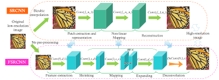

## Introduction
- The main objective is to generate a very high resolution Image (like DSLR cameras) from Low Resolution Input (VGA, QVGA)

- Main application areas like - Security, Smartphones, Criminal Investigations and surveillance
  
## Methods
### 1.1 SRCNN
- SRCNN is a prominent method.
- It has three layers  
- Patch Extraction layer and representation (9x9)
- Non linear mapping (1x1)
- Reconstruction (5x5)

### 1.2 

- In this approach a pair of layers (CNN and nonlinear) is cascaded repeatedly
- An interpolated low resoultion (ILR) goes through layers and transforms into a high resolution image.
- A residual image is predicted by network.
- This residual is added to the ILR to give the required output
- ReLU is the most common non-linear unit used.

#### 1.2.1 Features
- Loss functions
- SRCNN has a very small learning rate. Setting high learning rates lead to vanishing gradients.Adjustable gradient clipping is solution (i.e. clip gradients to [-theta/gamma, theta/gamma] where gamma is the learning rate)
  
- Use of scale augmentation to boost performance
##### 1.2.2 Hyperparameters

- Depth = 20
- Batch Size = 64
- Momentum = 0.9
- Weight Decay = 0.0001
- Weight Initialization = kaiming normalization
- Activations = ReLU
- Epochs = 80
- Learing Rate = 0.1 decreased by a factor 10 every 20 epochs
- Training Dataset = Berkely segmentation dataset